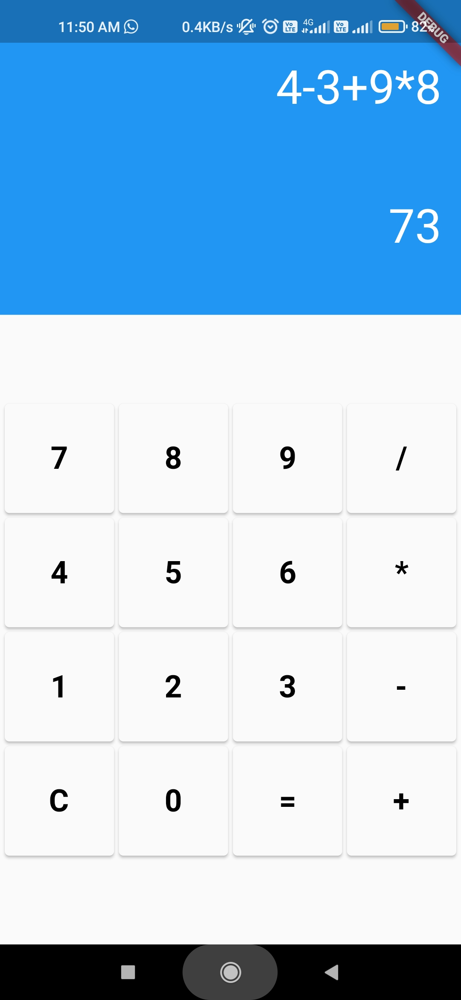

# **CALCULATOR APP**

This is a `Calculator` test application 
built using [Flutter](https://docs.flutter.dev/). Make sure to have flutter installed on your machine
Clone the repo to your local machine
Open an emulator and run flutter run within the cloned repo's folder.
Try it out. As a test of the 
framework, I wanted to implement something
simple that would help me get the basics down.

## **RUNNING THE APP**

Follow the steps below to run the app 
on your local machine. You'll need to
make sure you have `flutter` installed
and either Android Studio and XCode
installed to test this application in
a simulator. Let me know if you
encounter issues with the 
Calculator Screen. 

1. Make sure to have `flutter` installed 
   On your machine.
       
 2. Clone the repo to your local machine.
      
 3. Open an emulator and run `flutter run`
    Within the cloned repo's folder.

 4. Try it out.
 

      

